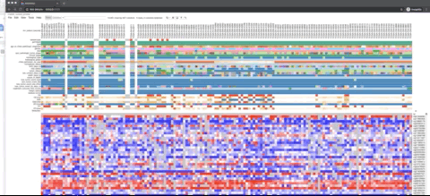

# Morpheus Colorectal Cancer DNA Methylation Browser

See an example deployment here: http://colo-flask3.eba-3yxerm5g.us-west-1.elasticbeanstalk.com/

---

This repo provides guidelines on how to visualize and analyze massive Colorectal Cancer DNA Methylation and Clinical datasets from [TCGA](https://portal.gdc.cancer.gov/) using javascript powered heatmaps [Morpheus.js](https://github.com/cmap/morpheus.js) in the browser.

We will utilize [Flask](https://palletsprojects.com/p/flask/) as our webserver to run a local instance of [Morpheus.js](https://github.com/cmap/morpheus.js).

## Clone this directory

Move to a suitable directory (using `~/Desktop/` for example purposes), clone the repo and enter the repo:

`cd ~/Desktop`

`git clone https://github.com/mmingay2/coloCancerBrowser.git`

`cd coloCancerBrowser`

Now make sure you have flask and flask_cors installed. You can install them using `pip install flask` and `pip install flask_cors`.

Once you have Flask installed and you are in this repo, run `python app.py` to start the Flask app.

Now visit the local URL [http://0.0.0.0:5000/](http://0.0.0.0:5000/) to start exploring the data.

Try sorting the data on a clinical feature by clicking the lable of the row you want to sort on.

You can also perform hierarchal clustering on the data. See below for an example or the [tutorials](https://software.broadinstitute.org/morpheus/tutorial.html) provided by the original developers.

After running the calculations, you will be able to see your clusters at the very top of the page.

---

